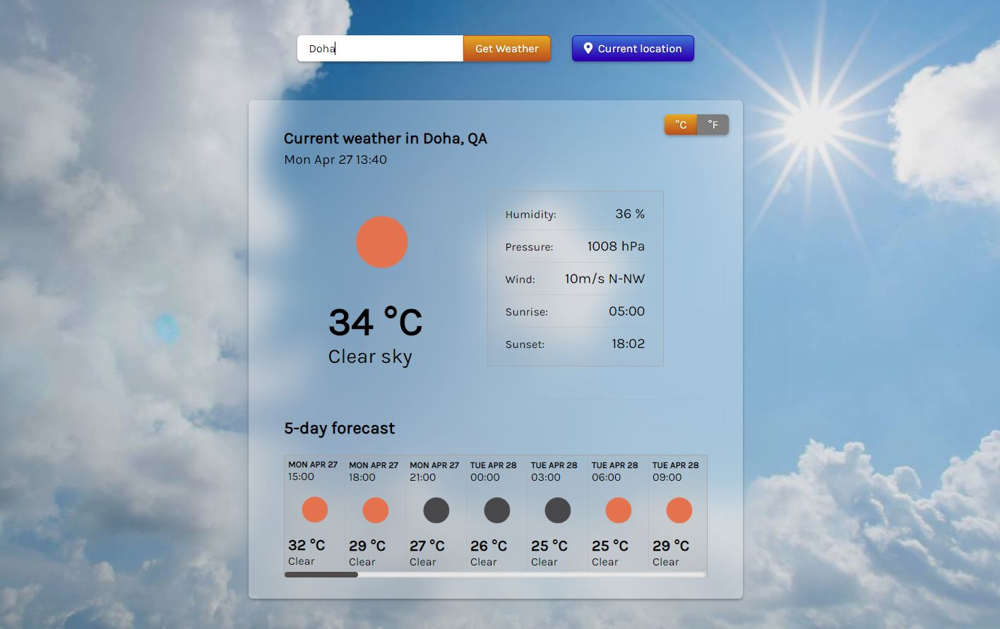
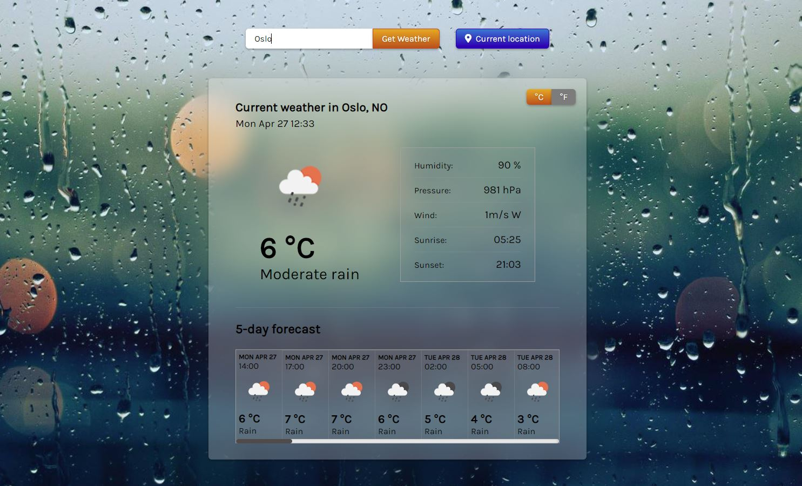

## Weather App

> Simple JavaScript weather app based on the OpenWeatherMap API.





## Live Demo

[Demo](https://rawcdn.githack.com/zenott/weather-app/c0f0c7059cde402b5365662a0956d52ff5e04b8a/dist/index.html)

## Built With

- HTML5
- CSS3
- JavaScript
- Cypress for testing

## Usage

### Prerequisites

- node
- npm

### Getting started

Clone the repository to your local machine

```
$ git clone https://github.com/BalintMendli/weather-app.git
```

Change into the project directory

```
$ cd weather-app
```

Install dependencies

```
$ npm install
```

Start development server

```
$ npm run dev
```

### Run the test suite

```
$ npm run cy:open
```

## Author

👤 **Balint Mendli**

- GitHub: [@BalintMendli](https://github.com/BalintMendli)
- Website: [mendli.com](https://mendli.com)
- Email: [balint@mendli.com](mailto:balint@mendli.com)

## 🤝 Contributing

Contributions, issues, and feature requests are welcome!
Feel free to check the [issues page](https://github.com/BalintMendli/react-calculator/issues/).

1. Fork it
2. Create your working branch

```
git checkout -b my-new-feature
```

3. Commit your changes

```
git commit -am 'Add some feature'
```

4. Push to the branch

```
git push origin my-new-feature
```

5. Create a new Pull Request

## Show your support

Give a ⭐️ if you like this project!

## Acknowledgments

- [Webpack](https://webpack.js.org/)
- [Luxon](https://moment.github.io/luxon/)
- [Unsplash.com](https://unsplash.com)

## 📝 License

This project is [MIT](LICENSE.md) licensed.
